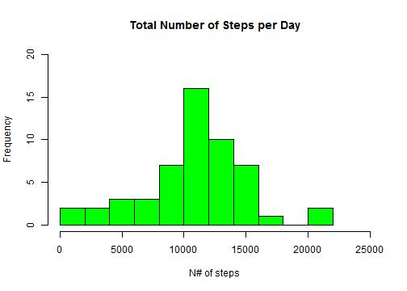
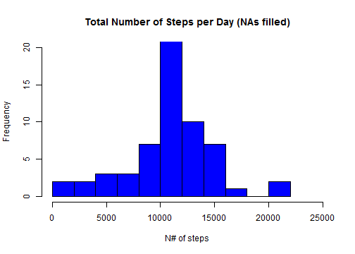

# Reproducible Research: Peer Assessment 1


###
### Loading and preprocessing the data.
###

First of all, we load the library **reshape2** and configure other necessary settings.


```r
library("reshape2")
Sys.setlocale("LC_TIME", "English")
par(mfrow=c(1,1))
```

Then, we do the following.

1. Load in the data temporarily as **dat0**.


```r
dat0 <- read.csv("activity.csv",header=TRUE)
```

2. Transform the data into a suitable format for analysis. The resulting dataset is called **dat**.


```r
dat1 <- dcast(data=dat0, date~interval, value.var= "steps")
ndimx = ncol(dat1)
ndimy = nrow(dat1)
x_val <- as.numeric(names(dat1)[2:ndimx])
names(dat1)[2:ndimx] <- paste("t",names(dat1)[2:ndimx],sep="")
dat2 <- transform(dat1, Date = strptime(as.character(date),"%Y-%m-%d",tz="America/New_York"))
dat  <- dat2[,c(ndimx+1,2:ndimx)]
```

###
### What is mean total number of steps taken per day?
###

For this part of the assignment, we ignore the missing values in
the dataset.

1. Calculate the total number of steps taken per day.

We add a new variable called **total** in the dataset to store the total number of steps per day.


```r
dat$total <- rowSums(dat[,2:ndimx])
```

2. Show a histogram of the total number of steps taken each day.


```r
hist(dat$total,breaks = 10, col = "green", 
     main = "Total Number of Steps per Day", 
     xlab = "N# of steps", 
     ylab = "Frequency",
     xlim = c(0,25000),
     ylim = c(0,20))
```



3. Calculate and report the **mean** and **median** total number of steps taken per day.


```r
mean1 <- round(mean(dat$total, na.rm=TRUE),0)
median1 <- median(dat$total, na.rm=TRUE)
```

Thus, the mean is **10766** and the median is **10765**.

###
### What is the average daily activity pattern?
###

1. Show a time series plot of the 5-minute interval (x-axis) vs the average number of steps taken, averaged across all days (y-axis).


```r
y_val <- colMeans(dat[,2:ndimx],na.rm = TRUE)
plot(x_val, y_val, type="l", main = "Time Series of N# of Steps", xlab = "Time interval", ylab="N# of Steps",ylim = c(0,250))
```


2. Which 5-minute interval, on average across all the days in the dataset, contains the maximum number of steps?

To answer this question, we execute the following code chunk.


```r
nmax <- which.max(y_val) - 1
nhour <- nmax %/%12
nminute  <- 5*(nmax - nhour*12)
```

As a result, we can see that the the peak interval happens at **835**.

###
### Imputing missing values.
###

 We notice that there are a number of days/intervals where there are missing
values (coded as `NA`). 

1. Calculate and report the total number of missing values in the dataset (i.e. the total number of rows with `NA`s)

 We can calculate in the following way:


```r
nna_vals <- sum(is.na(dat[,2:ndimx]))
nna_days <- sum(is.na(dat$total))
```
 
 Thus, the total number of missing values is **2304**. And, there are
 **8** days in which missing value cases occur.

2. We now devise a strategy for filling in all of the missing values in the dataset. 

We follow a simple strategy in which a missing vaue is *filled* by the mean for that 5-minute interval. This is implemented as following.


```r
datf <- dat
avg_val <- y_val

for( iy in 1:ndimy){
    if(is.na(datf$total[iy])){ 
        for (ix in 2:ndimx){
            if(is.na(datf[iy,ix])) {datf[iy,ix] <- round(avg_val[ix-1],0)}
        }        
    }
}

datf$total <- rowSums(datf[,2:ndimx])
```


3. Create a new dataset that is equal to the original dataset but with the missing data filled in.

The resulting dataset is called **datf**. Please, refer to the code chunk just above.

4. Make a histogram of the total number of steps taken each day. Calculate and report the **mean** and **median** total number of steps taken per day. Do these values differ from the estimates from the first part of the assignment? What is the impact of imputing missing data on the estimates of the total daily number of steps?

First, we repeat the histogram. We can notice that the peak has grown taller. This was expected because we filled the missing values with the interval averages.


```r
hist(datf$total,breaks = 10, col = "blue", 
     main = "Total Number of Steps per Day (NAs filled)", 
     xlab = "N# of steps", 
     ylab = "Frequency",
     xlim = c(0,25000),
     ylim = c(0,20))
```



Then we repeat the following calculations with this new dataset.


```r
mean2 <- round(mean(datf$total, na.rm=TRUE),0)
median2 <- median(datf$total, na.rm=TRUE)
```

From this, the new mean is **10766** and the new median is **10762**.

Comparing with the previous values, the change in mean is **0** and the change in median is **-3**.

###
### Are there differences in activity patterns between weekdays and weekends?
###

1. Create a new factor variable in the dataset with two levels -- "weekday" and "weekend" indicating whether a given date is a weekday or weekend day.

This is implemented as following. We call this new variable **wday**.


```r
datf$wday <-factor(weekdays(datf$Date) == "Saturday" | weekdays(datf$Date) == "Sunday", labels=c("weekday","weekend"))  
```

2. Make a panel plot containing a time series plot of the 5-minute interval (x-axis) vs the average number of steps taken, averaged across all weekdays or weekend days (y-axis). 


```r
y_vals <- matrix(nrow=2, ncol=ndimx-1)
for (ix in 2:ndimx){
    temp <- tapply(datf[,ix],datf$wday,mean)
    y_vals[1,ix-1] <- temp[1]
    y_vals[2,ix-1] <- temp[2]
    }
par(mfrow=c(2,1),mar=c(4,4,2,1),oma=c(0,0,2,0))
plot(x_val, y_vals[1,], type="l" , col = "blue", main = "Weekdays", xlab="", ylab="N# of Steps" , ylim = c(0,250))
plot(x_val, y_vals[2,], type="l" , col = "red", main = "Weekends", xlab = "Time interval", ylab="N# of Steps" ,ylim=c(0,250))
```


 On weekdays, there seems to be a single dominant peak at 835. However, on weekend days, there are multiple peaks of comparable height throughout the day.
 
 
 
